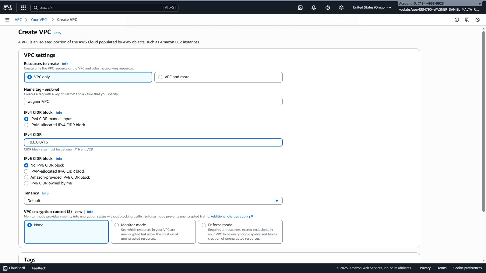
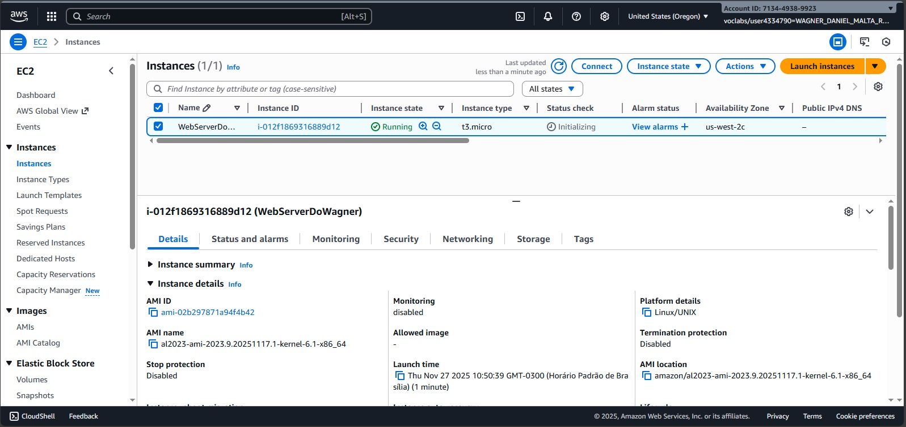
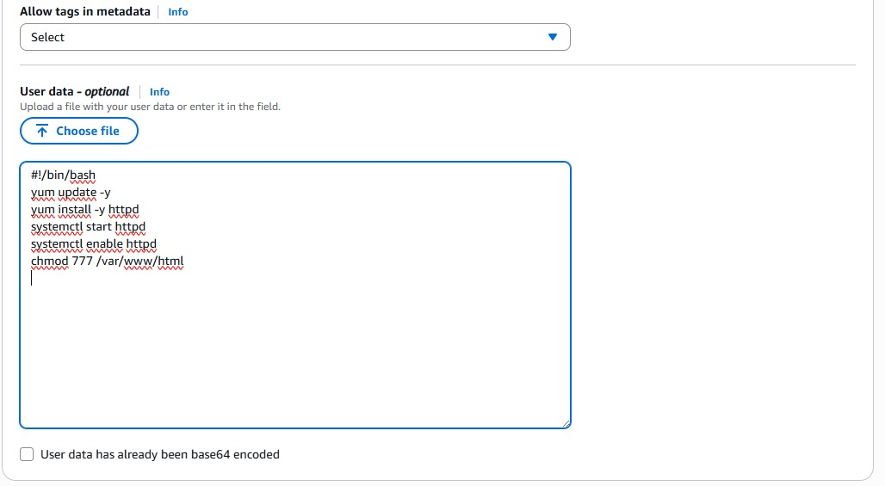
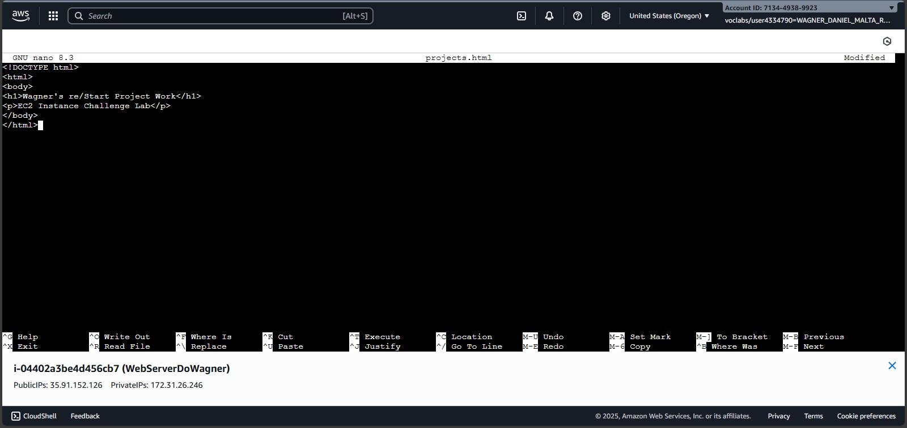
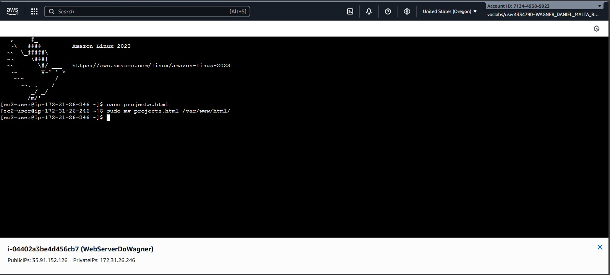
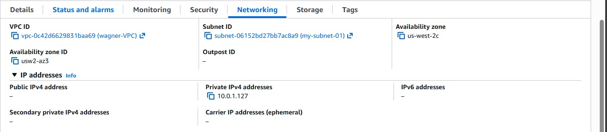
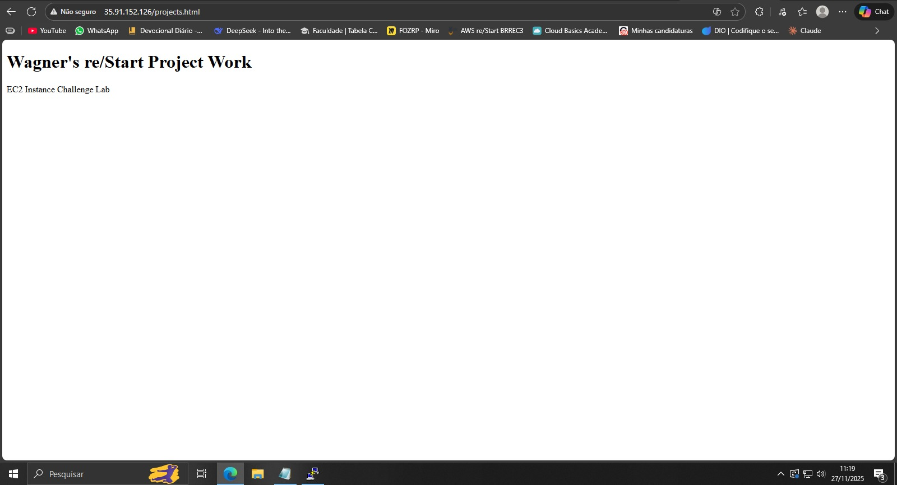
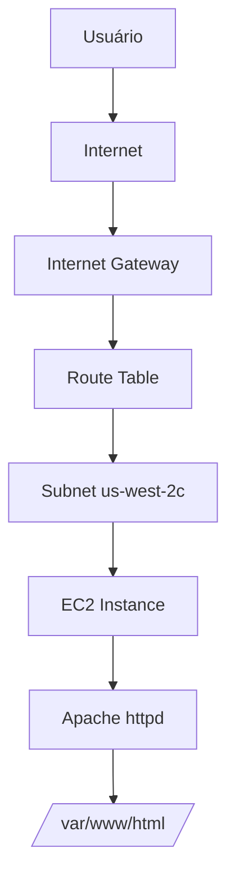

# ☁️ AWS EC2 Instance Challenge Lab


Laboratório desafiador de criação de instância EC2 completa com VPC, web server Apache e deploy de aplicação web estática.

*Descrição detalhada:*
```
🚀 Lab prático de Amazon EC2 com cenário real
• Criação de VPC personalizada com internet gateway
• Launch de instância EC2 Amazon Linux 2023
• Configuração automática via user data (Apache httpd)
• Deploy de aplicação web HTML estática
• Conexão SSH via EC2 Instance Connect
• Configuração completa de segurança e networking
```

## 🎯 OBJETIVOS DE APRENDIZADO

- ✅ Criar VPC personalizada com subnets
- ✅ Configurar instância EC2 Amazon Linux
- ✅ Instalar e configurar servidor web Apache
- ✅ Deploy de aplicação web estática
- ✅ Configurar segurança (security groups)
- ✅ Conectar via EC2 Instance Connect

## 🏗️ CENÁRIO DA ARQUITETURA

| Componente | Especificações | Propósito |
|------------|----------------|-----------|
| **EC2 Instance** | t3.micro, Amazon Linux 2023 | Servidor web |
| **VPC** | wagner-VPC (10.0.0.0/16) | Rede isolada |
| **Subnet** | my-subnet-01 (us-west-2c) | Sub-rede pública |
| **Storage** | gp2, 8GB | Volume root |
| **Web Server** | Apache httpd | Hospedagem web |

## 🛠️ EXECUÇÃO PASSO A PASSO

### Passo 1: Criação da VPC

**Configurações da VPC:**
- **Nome**: `wagner-VPC`
- **IPv4 CIDR**: `10.0.0.0/16`
- **IPv6**: Não configurado
- **Tenancy**: Default



### Passo 2: Configuração de Rede Adicional
- ✅ **Internet Gateway**: Criado e anexado à VPC
- ✅ **Route Table**: Configurada com rota para internet
- ✅ **Subnet**: `my-subnet-01` em `us-west-2c`

### Passo 3: Launch da Instância EC2

**Configurações da Instância:**
- **Nome**: `WebServerDoWagner`
- **AMI**: Amazon Linux 2023
- **Tipo**: t3.micro
- **VPC**: `wagner-VPC`
- **Subnet**: `my-subnet-01`
- **Auto-assign Public IP**: Habilitado



### Passo 4: Configuração de User Data

**Script de inicialização automática:**
```bash
#!/bin/bash
yum update -y
yum install -y httpd
systemctl start httpd
systemctl enable httpd
chmod 777 /var/www/html
```



### Passo 5: Configuração de Security Group
- ✅ **SSH (22)**: Acesso via EC2 Instance Connect
- ✅ **HTTP (80)**: Acesso público ao web server
- ✅ **Source**: 0.0.0.0/0 para HTTP, restrito para SSH

### Passo 6: Conexão e Deploy da Aplicação

```bash
# Conectar via EC2 Instance Connect
# Criar arquivo HTML
nano projects.html
```

**Conteúdo do arquivo projects.html:**
```html
<!DOCTYPE html>
<html>
<body>
<h1>Wagner's re/Start Project Work</h1>
<p>EC2 Instance Challenge Lab</p>
</body>
</html>
```



```bash
# Mover arquivo para diretório web
sudo mv projects.html /var/www/html/
```



### Passo 7: Verificação e Testes

**Detalhes da rede da instância:**
- **Public IPv4**: `35.91.152.126`
- **Private IPv4**: `172.31.26.246`
- **VPC ID**: `vpc-0c42d6629831baa69`
- **Subnet ID**: `subnet-06152bd27bb7ac8a9`



**Acesso ao website:**
```
http://35.91.152.126/projects.html
```

**Resultado no navegador:**


## ⚡ ARQUITETURA TÉCNICA

### Fluxo de Comunicação


### Especificações Técnicas
- **Sistema Operacional**: Amazon Linux 2023
- **Kernel**: 6.1 x86_64
- **Web Server**: Apache httpd 2.4
- **Storage**: EBS gp2 8GB
- **Network**: VPC com internet gateway

## 📊 RESULTADOS OBTIDOS

### ✅ Componentes Implementados

| Componente | Status | Evidência |
|------------|--------|-----------|
| VPC Personalizada | ✅ |  |
| Instância EC2 | ✅ |  |
| Apache Instalado | ✅ | User Data configurado |
| Aplicação Web | ✅ |  |
| Acesso Público | ✅ | IP: 35.91.152.126 |

### ✅ Configurações de Segurança
- **SSH**: Acesso restrito via EC2 Instance Connect
- **HTTP**: Acesso público permitido
- **VPC**: Isolamento de rede completo
- **IAM**: Permissões mínimas necessárias

## 🎓 CONCLUSÕES E COMPETÊNCIAS

### ✅ Competências Desenvolvidas
- **VPC Management**: Criação e configuração de rede virtual
- **EC2 Launch**: Configuração completa de instância
- **Automation**: User data para configuração automática
- **Web Server**: Instalação e configuração do Apache
- **Deployment**: Deploy de aplicações web estáticas

### 📚 Lições Aprendidas
1. **User Data**: Automatiza configurações pós-launch
2. **VPC Isolation**: Importante para segurança
3. **Security Groups**: Controle granular de acesso
4. **EC2 Instance Connect**: Conexão SSH simplificada
5. **AMI Selection**: Escolha correta do sistema operacional

### 🚀 Aplicações Práticas
- Servidores web simples
- Ambientes de desenvolvimento
- Aplicações de demonstração
- Protótipos rápidos
- Laboratórios educacionais

## 📚 RECURSOS ADICIONAIS

### Documentação Oficial
- [EC2 User Guide](https://docs.aws.amazon.com/AWSEC2/latest/UserGuide/concepts.html)
- [VPC Documentation](https://docs.aws.amazon.com/vpc/latest/userguide/what-is-amazon-vpc.html)
- [EC2 Instance Connect](https://docs.aws.amazon.com/AWSEC2/latest/UserGuide/Connect-using-EC2-Instance-Connect.html)
